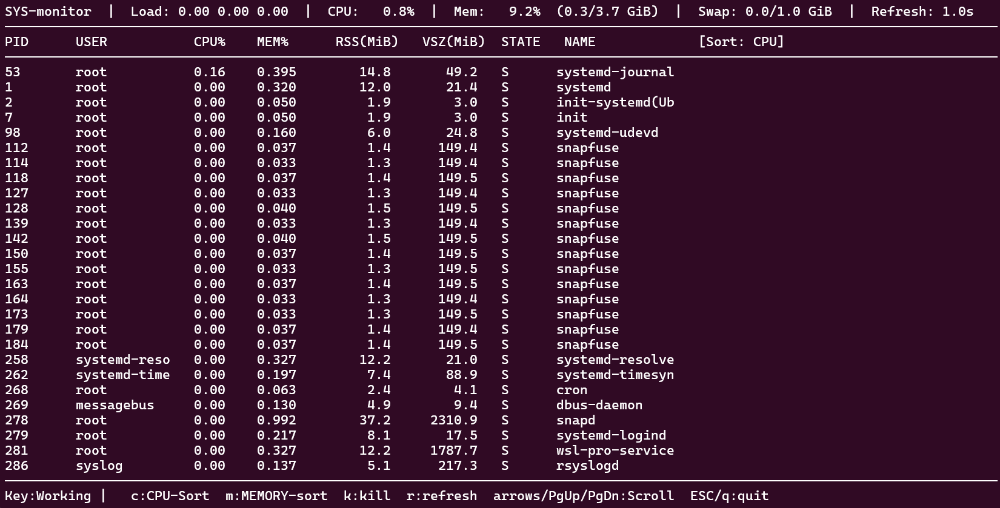

# SYSTEM Monitoring Program for LINUX
This project implements a real-time system monitoring tool in C++. The program gathers live system data from the /proc filesystem and displays information about running processes, CPU load, and memory usage through a text-based user interface built with the ncurses library.

The application supports user interaction:

- Sort processes by CPU (c) or memory usage (m)

-  Scroll through process list (arrow keys / page keys)

- Kill a process by entering a PID (k)

- Adjust refresh rate (r)

- Exit (q/ESC)

### Requirements :
- Linux OS
- Compiler with C++17 Support (like g++)
- library : ncurses (for text-based UI rendering)
- Terminal
### How to use :
1. Install Required Dependencies :
**g++** (Compiler) and **ncurses** (UI lib)
     cmd : **sudo apt update
sudo apt install g++ libncurses5-dev libncursesw5-dev**
 

2. Navigate to the project folder using **cd** cmd 

3. Compile the program:
     cmd : **g++ SYS-monitor.cpp -lncurses -o monitor**

4. Run the program:
 cmd : **./monitor**

### Overview :

